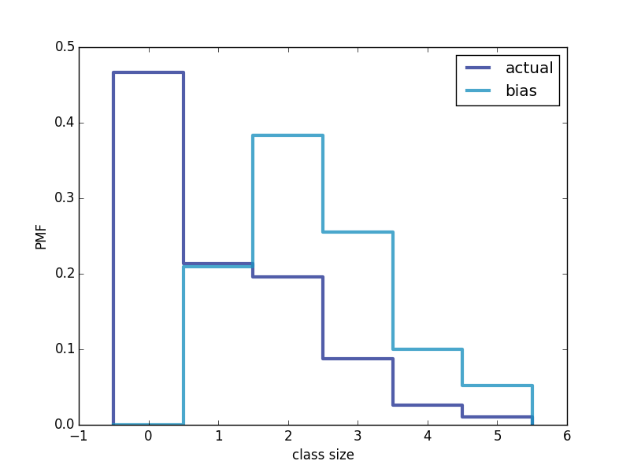

[Think Stats Chapter 3 Exercise 1](http://greenteapress.com/thinkstats2/html/thinkstats2004.html#toc31) (actual vs. biased)

>> Plot of Actual and Biased distributions :
 
 
 
 Mean of actual PMF : 1.0242051550438309
 Mean of biased PMF : 2.4036791006642821
