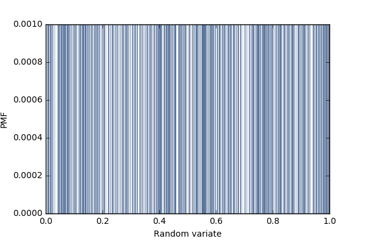

[Think Stats Chapter 4 Exercise 2](http://greenteapress.com/thinkstats2/html/thinkstats2005.html#toc41) (a random distribution)

>> It seems that the random number generator is close to random as the PMF shows an almost uniform distribution of random values each with a probability of occurence equal to .001 or 1/1000.

The CDF shows an almost straight line indicating that the distribution of random numbers is almost uniform.

```
import nsfg
import thinkstats2
import thinkplot

import numpy as np
import matplotlib.pyplot as plt
%matplotlib inline

r = np.random.random(1000)

pmf = thinkstats2.Pmf(r)
thinkplot.Pmf(pmf, linewidth=0.1)
thinkplot.Config(xlabel='Random variate', ylabel='PMF')
plt.savefig('rand_dist1.png')

```



```
cdf = thinkstats2.Cdf(r)
thinkplot.Cdf(cdf)
thinkplot.Config(xlabel='Random variate', ylabel='CDF')
plt.savefig('rand_dist2.png')
```


